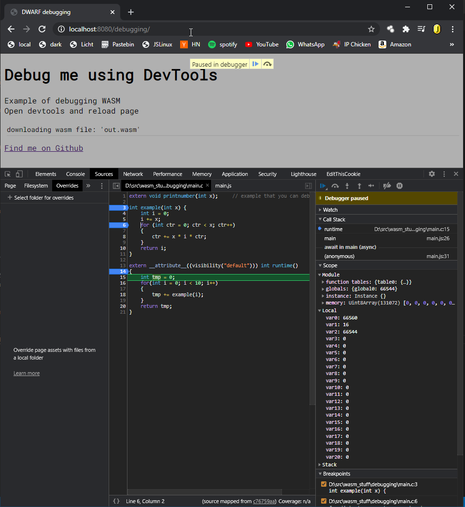

# Debugging c with Chrome

## Introduction 

In this example we're using the DWARF format to debug c code live with the DevTools from your browser.
You can also debug cross `JS` / `C`

---

Example: 

---

## Requirements

> Make

> Clang 9 or above

> Chrome (tested on Chrome 85)

> A Webserver [you can find a webserver here (py3)](../server4.py)

## Files

What|Description
--------|-----------
`main.c` | this uses async.h for async functions to fetch [hello.txt](hello.txt) and return its length
`main.js` | this file provides object handling, initialization of the wasm and the main event loop
## Example

[live example](https://k0in.github.io/wasm_stuff/debugging/index.html)

## Note

I compile wasm on Windows using WSL due to this the directory of my source(referenced in the dwarf file) is the Linux path.
If chrome tries to access it, it will fail since it's not accessible from windows.
To fix this I use the compiler flag: -fdebug-compilation-dir to set the correct directory to the windows' path.